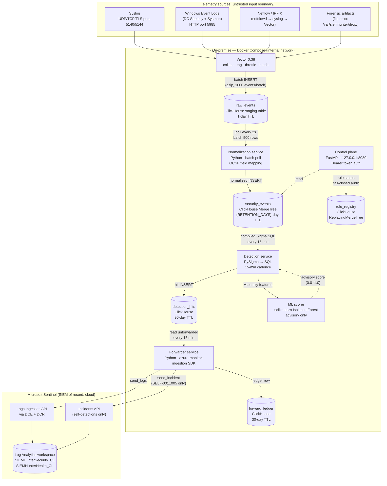

# SIEMhunter Architecture

> Audience: engineers and operators who need to understand how SIEMhunter works
> internally — not just what it does but why each component exists and how they
> connect. For the quick-start, see README.md. For API reference, see API.md.

---

## What SIEMhunter is (and is not)

SIEMhunter is an **on-premise collector agent**, not a standalone SIEM. It sits
close to a lab network, ingests security telemetry from multiple sources,
normalizes everything to a common schema, runs batch detections, and forwards
results to **Microsoft Sentinel** — which remains the SIEM of record and the
analyst's primary interface.

It is explicitly NOT:
- A real-time detection system (batch cadence: 15–60 minutes by default)
- A standalone SIEM (no analyst console; Sentinel owns triage)
- Internet-facing (the control plane is localhost-only; forwarding is outbound HTTPS only)

---

## System dataflow



---

## Component responsibilities

### Vector (ingest edge)

Vector is the only component that faces the untrusted ingest boundary. It:

- Accepts syslog (UDP/TCP/TLS), Windows Event Forwarding (HTTP), and forensic artifact file drops
- Assigns a **ProvenanceTag** to every event at receipt time — this is the tamper-evidence anchor; downstream components trust the tag, not the event's own claims about its origin
- Applies a **rate throttle** per ProvenanceTag prefix (10,000 events/60 s by default) to protect ClickHouse from ingest floods
- Enforces a 64 KiB per-event size cap
- Writes tagged events to the `raw_events` staging table in ClickHouse via gzip-compressed batched HTTP inserts

**Failure mode:** If ClickHouse is unavailable, Vector buffers events in its in-memory/tmpfs buffer (128 MiB). Events that cannot be delivered after retries (3 attempts, 30 s max) are dropped and a warning is logged. Vector does not have a persistent on-disk queue in the default configuration; a Redpanda buffer (optional) would provide durability.

### ClickHouse (local columnar store)

ClickHouse is the local hot store and the detection engine's data source. It is on the `internal` Docker network — no host or LAN ports are published.

Tables:

| Table | Written by | Read by | TTL |
|-------|------------|---------|-----|
| `raw_events` | Vector | Normalization | 1 day |
| `security_events` | Normalization | Detection, API | `RETENTION_DAYS` days |
| `detection_state` | Detection (future) | Detection (future) | per-row expiry |
| `detection_hits` | Detection | Forwarder | 90 days |
| `forward_ledger` | Forwarder | Forwarder (SELF-005) | 30 days |
| `rule_registry` | API | Detection | no TTL |

The `security_events` table uses `ORDER BY (TimeGenerated, HostName, EventID)` — the most common query pattern for Sigma rules is "events in a time window for a specific EventID and host". MergeTree's sort-key index makes these queries fast without secondary indexes.

### Normalization service

A Python service that polls `raw_events` every 2 seconds, normalizes events to the OCSF/ASIM schema, and inserts them into `security_events`. It then deletes the processed `raw_events` rows.

Four normalizers handle the four source types:

- `normalize_windows_event`: Maps Windows event XML fields (EventID, SubjectUserName, Image, etc.) to canonical columns. Parses the Sysmon `Hashes` string into separate MD5/SHA256 columns.
- `normalize_syslog`: Maps RFC 3164/5424 fields. The syslog message body goes to `CommandLine`.
- `normalize_netflow`: Maps Netflow/IPFIX flow records. Translates IANA protocol numbers to lowercase names.
- `normalize_forensic`: Permissive mapping for Velociraptor/Volatility JSON; stores unrecognized fields in `UnmappedFields`.

The dispatcher (`dispatch()`) routes events by ProvenanceTag prefix and applies rate limiting before calling any normalizer.

**Failure mode:** If the ClickHouse INSERT fails, the `raw_events` rows are NOT deleted and will be retried on the next batch cycle (at-least-once semantics). If parsing a single event fails, the event is dropped and logged — the service does not crash.

### Detection service

A batch scheduler that runs every `DETECTION_INTERVAL_SECONDS` (default: 900 s / 15 min). Each cycle:

1. Re-compiles all Sigma rules from disk using pySigma (hot-reload without container restart)
2. Executes each compiled SQL query against `security_events` for the current time window
3. Attaches ML advisory scores (Isolation Forest) to entities found in hits
4. Inserts detection hit records into `detection_hits`

**What "compile" means:** pySigma reads the Sigma YAML rule and the `clickhouse-asim-ocsf.yaml` pipeline (field name map) and produces a ClickHouse SQL SELECT statement. The detection service then wraps this SQL in a time-window subquery before execution.

**Failure mode:** A broken production rule (fails to compile) causes the entire detection cycle to abort. Rules with status `draft` or `disabled` are skipped at compile time. Non-production compilation failures are logged as warnings; the service continues with the remaining rules.

### ML scorer (inside detection service)

An advisory-only Isolation Forest model loaded from `joblib` artifacts at service startup. It:

- Scores entities (users, hosts) that appear in Sigma detection hits on a 0.0–1.0 anomaly scale
- Never causes hits to be created or suppressed; it only sets the `anomaly_score` field on existing hits
- Is skipped gracefully if no model artifacts are deployed (Sigma detection still runs)
- Verifies model artifact SHA-256 hashes before loading (supply chain protection)

### Forwarder service

Reads unforwarded detection hits from `detection_hits` (where `forwarded_at IS NULL`) and pushes them to Sentinel every `FORWARD_INTERVAL_SECONDS` (default: 900 s).

Two forwarding paths:

1. **Logs Ingestion API** (via DCE/DCR): All detection hits → `SIEMHunterSecurity_CL`. This is the primary path. Sentinel analytics rules query this table to create incidents.
2. **Incidents API** (via ARM): High/critical self-detection hits only (SELF-001 through SELF-005) → Sentinel Incidents API. These create incidents directly because self-detection events represent SIEMhunter's own security posture.

**Retry behaviour:** Failed batches are retried up to 5 times with exponential backoff (10 s → 20 s → 40 s → 80 s → 160 s, capped at 300 s). After 5 failures, the batch is serialised to the on-disk retry queue (`/app/retry_queue/*.json`). The retry queue is persisted in a named Docker volume so it survives container restarts. At the start of each cycle, due retry-queue entries are replayed before processing new hits.

**SELF-005 ledger reconciliation:** After each forward cycle, the forwarder compares the local `forward_ledger` event count with the count received by Sentinel (queried via KQL, if `SELF005_ENABLED=true`). A discrepancy above 5% or 50 events triggers a `LedgerDelta` event in `SIEMHunterHealth_CL`.

### Control plane (FastAPI API)

Binds to `127.0.0.1:8080` only. Never accessible from the LAN. All endpoints require Bearer token authentication.

Endpoints:

| Method | Path | Auth | Purpose |
|--------|------|------|---------|
| GET | `/v1/health` | None | Docker health check |
| GET | `/v1/status` | Bearer | Pipeline health summary |
| POST | `/v1/query` | Bearer | Read-only ClickHouse query (SELECT only) |
| GET | `/v1/rules` | Bearer | List all rules from registry |
| GET | `/v1/rules/{rule_id}` | Bearer | Get one rule's status |
| PUT | `/v1/rules/{rule_id}/status` | Bearer | Promote/demote a rule (fail-closed audit) |

The rule status change endpoint enforces a fail-closed audit sequence: Sentinel receives the audit record BEFORE ClickHouse is updated. If Sentinel is unreachable, the change is rejected with HTTP 503.

---

## Trust boundaries

### Boundary 1 — Ingest (untrusted sources → Vector)

Every byte of ingest payload is treated as hostile. Protections:
- ProvenanceTag assigned by collector (not from event content)
- 64 KiB per-event size cap
- Rate throttle (10,000 events/60 s per source type)
- No decompression at this layer (raw bytes only)

### Boundary 2 — Staging to normalization (Vector → raw_events → Normalization)

- All ClickHouse inserts use parameterized queries (no string interpolation)
- Rate limiting applied a second time in the normalization service
- Decompression-ratio cap enforced before any JSON parsing

### Boundary 3 — Detection engine (normalization → security_events → Detection)

- Detection queries are compiled from Sigma YAML at startup, not from user input
- ClickHouse is internal-only; the detection service cannot reach external networks
- Production rule compilation failures are hard errors (abort the cycle)

### Boundary 4 — Forwarding (internal → cloud)

- Outbound HTTPS only; no inbound connectivity
- TLS certificate verification always enabled (no `verify=False`)
- App registration + certificate authentication (no client secrets)
- SSRF guard: RFC 1918, loopback, and IMDS addresses are blocked before connection
- DCE URI validated against an allowlist regex

### Boundary 5 — Control plane (operator → API)

- Binds to 127.0.0.1 only; not accessible from LAN
- Bearer token authenticated; constant-time comparison (`hmac.compare_digest`)
- SQL endpoint: SELECT-only enforcement, 10,000-row cap, 30-second timeout
- Rule changes: fail-closed audit (Sentinel write before ClickHouse update)

---

## Network topology

```
                    Host LAN
                        │
              ┌─────────▼──────────┐
              │  ingest network    │ ← ports 5140/5144/5985 exposed
              │  (Docker bridge)   │
              └────────┬───────────┘
                       │
                    Vector
                       │
         ┌─────────────▼─────────────┐
         │   internal network        │ ← no host ports; no external routing
         │   (Docker bridge,         │
         │    internal: true)        │
         │                           │
         │  ClickHouse               │
         │  Normalization            │
         │  Detection                │
         │  API (127.0.0.1:8080)     │
         └───────────┬───────────────┘
                     │
         ┌───────────▼───────────────┐
         │   egress network          │ ← outbound HTTPS only
         │   (Docker bridge)         │
         │                           │
         │  Forwarder                │──────► management.azure.com
         └───────────────────────────┘         *.ingest.monitor.azure.com
```

The Forwarder is the ONLY container on the `egress` network. All other containers are on `internal` (no external routing). The API is on `internal` but published to `127.0.0.1:8080` only — not to `0.0.0.0`.

---

## Batch timing

All three worker services use the same default interval (900 s / 15 min). In practice:

```
Minute 0:  Vector ingests event batch 1 → raw_events
Minute 0–2: Normalization polls → security_events
Minute 15: Detection cycle 1 — queries events from minute 0–15 → detection_hits
Minute 15: Forwarder cycle 1 — reads detection_hits → Sentinel
Minute 30: Detection cycle 2 — queries events from minute 15–30
...
```

Maximum latency from event occurrence to Sentinel visibility: ~30 minutes (one normalization lag + one detection interval + one forward interval). Acceptable for the home-lab threat-hunting use case.

---

## Schema alignment triangle

Three files must agree on field names and types. Any change to the schema requires updating all three:

```
services/normalization/src/schema.py     ←→   clickhouse/schema.sql
                   ↕
rules/pipelines/clickhouse-asim-ocsf.yaml
```

- `schema.py` is the Python dataclass (authoritative Python representation)
- `schema.sql` is the ClickHouse DDL (authoritative SQL representation)
- `clickhouse-asim-ocsf.yaml` is the pySigma field map (Sigma field name → ClickHouse column name)

See the change protocol in `instructions/04-normalization-and-schema.md §8`.

---

## Key references

| Topic | Document |
|-------|----------|
| Full requirements | `instructions/02-requirements.md` |
| Ingest spec | `instructions/03-data-ingestion-spec.md` |
| Schema spec | `instructions/04-normalization-and-schema.md` |
| Detection spec | `instructions/05-detection-and-anomaly.md` |
| API spec | `instructions/06-api-control-plane.md` |
| Sentinel forwarding | `instructions/07-sentinel-forwarding.md` |
| Deployment | `instructions/08-deployment-hybrid.md` |
| IAM / credentials | `instructions/09-security-and-iam.md` |
| Credential ADR | `instructions/15-adr-forwarder-credential.md` |
| Threat model | `instructions/14-threat-model.md` |
