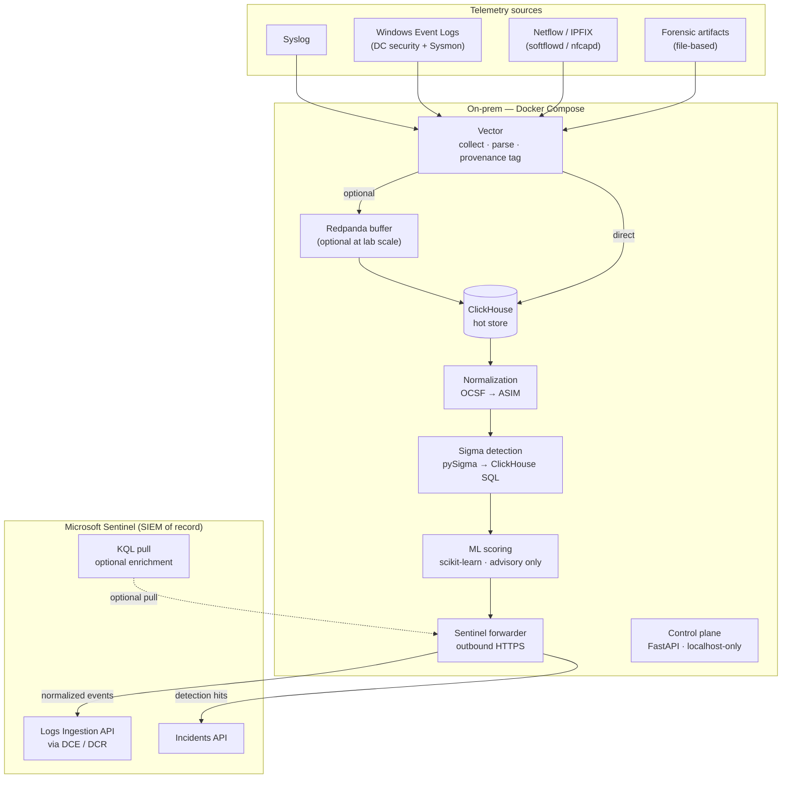

# SIEMhunter

> Lightweight on-premise security event collector and Sentinel forwarder.
> Ingest → normalize → detect → forward.

**Status:** v0.1.0 · Application code and documentation complete · Not yet production-validated

---

## What it is

SIEMhunter is an **on-premise collector agent**, not a standalone SIEM. It sits
close to your lab network, ingests security telemetry from multiple sources,
normalizes everything to OCSF/ASIM, runs batch Sigma and baseline ML detections,
then forwards normalized events and detection hits to **Microsoft Sentinel** —
which remains the SIEM of record and the analyst's investigation surface.

Detection runs on a **15–60 minute batch cadence**, which removes the cost and
fragility of a real-time pipeline while still surfacing threats within an
investigation-friendly window. Deployment is a single `docker compose up` on
any on-premise Linux host.

**What it is NOT:**
- Not a standalone SIEM — no analyst console; Sentinel owns triage and case management
- Not real-time — batch detection only (one real-time exception: the ingest-flood heuristic)
- Not internet-facing — the control plane is localhost-only; the forwarder is outbound HTTPS only

---

## Architecture



> **Key:** OCSF = Open Cybersecurity Schema Framework · ASIM = Advanced Security
> Information Model (Sentinel's normalized schema) · DCE/DCR = Data Collection
> Endpoint / Data Collection Rule · KQL = Kusto Query Language

---

## v0.1.0 Scope

### In scope

| Area | Detail |
|------|--------|
| Ingestion | Syslog, Windows Event Logs (DC security + Sysmon), Netflow/IPFIX, forensic artifacts |
| Local store | ClickHouse |
| Normalization | OCSF → ASIM mapping layer |
| Detections | Batch Sigma rules (pySigma → ClickHouse SQL) |
| ML | Baseline anomaly scoring — Isolation Forest + z-score (advisory; never fires incidents independently) |
| Self-detections | 5 built-in rules covering SIEMhunter's own attack surface (ship first) |
| Windows/AD TTPs | Kerberoasting, AS-REP Roasting, DCSync, LSASS access, lateral movement |
| Sentinel forwarding | Logs Ingestion API (DCE/DCR) + Incidents API |
| Control plane | FastAPI, localhost-only, authenticated |
| Deployment | Docker Compose, on-premise |

### Deferred (not in v0.1.0)

AI/LLM detection · OWASP web-layer TTPs · APT multi-stage correlation ·
OpenSearch · PCAP/memory forensics · Real-time streaming · Multi-tenant RBAC ·
Reporting UI

---

## Self-detections

SIEMhunter monitors its own security posture before it monitors anything else.
These five rules reach production status before any Windows/AD rule is promoted.

| Rule ID | Name | What it detects |
|---------|------|-----------------|
| SELF-001 | CertAnomalyDetected | Service principal authenticates to Sentinel from an IP outside the 30-day baseline |
| SELF-002 | IngestFloodDetected | Vector flood heuristic fired (events/sec per source exceeded threshold for 60 s) |
| SELF-003 | RuleDisableAudit | A Sigma rule was disabled or modified via the FastAPI control plane |
| SELF-004 | DecompressionCapTrip | A forensic artifact exceeded the decompression ratio cap |
| SELF-005 | LedgerReconciliationDelta | Forwarded event count (local ledger) does not match received count in Sentinel at end of batch |

---

## Repository layout

```
SIEMhunter/
├── README.md
├── advise.md                          — red-team advisory (for ad-redteamer Phase 5)
├── .gitignore
├── instructions/                      — planning + spec documents (Claude-readable)
│   ├── 00-orchestration-plan.md       — master multi-agent build plan (start here)
│   ├── 01-architecture-overview.md
│   ├── 02-requirements.md
│   ├── 03-data-ingestion-spec.md
│   ├── 04-normalization-and-schema.md
│   ├── 05-detection-and-anomaly.md
│   ├── 06-api-control-plane.md
│   ├── 07-sentinel-forwarding.md
│   ├── 08-deployment-hybrid.md
│   ├── 09-security-and-iam.md
│   ├── 10-acceptance-criteria.md
│   ├── 11-glossary.md
│   ├── 12-data-retention-and-lifecycle.md
│   ├── 13-agent-task-matrix.md
│   ├── 14-threat-model.md
│   ├── 15-adr-forwarder-credential.md
│   └── 16-hardening-checklist.md
└── rules/
    ├── pipelines/
    │   └── clickhouse-asim-ocsf.yaml  — pySigma schema contract (authoritative field map)
    ├── [local/]                        — planned
    │   ├── [self_detection/]           — 5 built-in self-detections
    │   └── [windows_ad/]              — Kerberoasting, DCSync, LSASS, lateral movement
    ├── [sigma/]                        — planned: pinned SigmaHQ community snapshot
    ├── [compiled/]                     — generated (gitignored)
    └── [tests/]                        — planned: positive + negative sample events
```

Items in `[brackets]` under `rules/` are planned but not yet created; all `instructions/` files now exist.

---

## Project Architecture at a Glance

Six services work together in a Docker Compose stack. Data flows left to right:

```
[Telemetry sources]
  Syslog (UDP/TCP/TLS) ─────┐
  Windows Event Logs (HTTP) ─┤
  Netflow/IPFIX ─────────────┤──► Vector ──► raw_events (ClickHouse staging)
  Forensic artifacts (files) ┘         │
                                        │ flood heuristic (real-time, SELF-002)
                                        ▼
                              Normalization service
                              (OCSF field mapping)
                                        │
                                        ▼
                              security_events (ClickHouse)
                                        │
                                        ▼
                              Detection service
                              (pySigma SQL, every 15 min)
                                        │
                              ML scorer (advisory, Isolation Forest)
                                        │
                                        ▼
                              detection_hits (ClickHouse)
                                        │
                                        ▼
                              Forwarder service ──► Microsoft Sentinel
                              (every 15 min)         SIEMHunterSecurity_CL
                                                      SIEMHunterHealth_CL
                                                      Incidents API (self-detections)

Control plane: FastAPI (127.0.0.1:8080) — rule lifecycle, ad-hoc queries, status
```

**Six services, one Docker Compose stack:**

| Service | Image | Role |
|---------|-------|------|
| Vector | `ghcr.io/vectordotdev/vector:0.38.0` | Ingest edge: collect, tag, throttle, write to ClickHouse staging |
| ClickHouse | `clickhouse/clickhouse-server:24.3` | Local columnar store: detection engine and query backend |
| normalization | Python 3.12 (built) | Poll raw_events, apply OCSF field mapping, write security_events |
| detection | Python 3.12 (built) | Compile Sigma rules to SQL, run every 15 min, write detection_hits |
| forwarder | Python 3.12 (built) | Push detection_hits to Sentinel via Logs Ingestion API |
| api | Python 3.12 / FastAPI (built) | Control plane: rule lifecycle, status, ad-hoc queries |

For detailed service descriptions, data flows, and trust boundary analysis, see
[ARCHITECTURE.md](ARCHITECTURE.md).

---

## Getting Started

### Prerequisites

- Docker (24.x) and Docker Compose (plugin-style: `docker compose`)
- An on-premise Linux host (or WSL2 on Windows) with ~4 GB RAM available for Docker
- An Azure subscription with a Log Analytics workspace and Sentinel enabled
- Two Azure app registrations with certificates (see [DEPLOYMENT.md](DEPLOYMENT.md) for setup)

### Step 1: Clone and prepare secrets

```sh
git clone <repo-url> SIEMhunter
cd SIEMhunter
mkdir -p secrets

# ClickHouse password (used internally between containers)
echo "choose-a-strong-password" > secrets/clickhouse_password.txt

# API bearer token (used to authenticate against the control plane)
python3 -c "import secrets; print(secrets.token_hex(32))" > secrets/api_auth_token.txt

# Sentinel certificates (from your Azure app registrations)
# Replace these with your actual certificate PEM files:
cp /path/to/push-cert.pem secrets/forwarder_cert_push.pem
cp /path/to/pull-cert.pem secrets/forwarder_cert_pull.pem
```

### Step 2: Configure Sentinel endpoints

Edit `config/siemhunter.yaml` with your Azure values. The file is pre-populated
with placeholder comments explaining each field:

```yaml
sentinel:
  workspace_id: "your-workspace-guid"
  dce_uri: "https://your-dce.eastus.ingest.monitor.azure.com"
  tenant_id: "your-tenant-guid"
  push_client_id: "your-push-app-client-id"
  dcr_ids:
    SIEMHunterSecurity_CL: "/subscriptions/.../dataCollectionRules/..."
    SIEMHunterHealth_CL: "/subscriptions/.../dataCollectionRules/..."
```

See [config/siemhunter.example.yaml](config/siemhunter.example.yaml) for a fully
documented version of every configuration key.

### Step 3: Start the stack

```sh
docker compose up --build
```

On first start, ClickHouse runs the schema initialisation script and creates
all tables. You should see:

```
clickhouse | Initialising SIEMhunter schema (retention 30 days)...
clickhouse | Schema initialised.
```

### Step 4: Verify the pipeline is healthy

```sh
TOKEN=$(cat secrets/api_auth_token.txt)

# Health check (no auth needed)
curl http://localhost:8080/v1/health
# Expected: {"status":"ok"}

# Pipeline status (auth required)
curl -H "Authorization: Bearer $TOKEN" http://localhost:8080/v1/status
# Expected: all three *_alive fields = true, pending_retry_queue = 0
```

### Step 5: Send a test event

```sh
# Send a syslog UDP event
echo "Jun 19 12:00:00 testhost sshd[1234]: Accepted password for user from 10.0.0.5 port 22" \
  | nc -u localhost 5140

# After 2–5 seconds, verify it arrived in security_events
TOKEN=$(cat secrets/api_auth_token.txt)
curl -s -X POST http://localhost:8080/v1/query \
  -H "Authorization: Bearer $TOKEN" \
  -H "Content-Type: application/json" \
  -d '{"sql": "SELECT TimeGenerated, HostName, ChannelName, ProvenanceTag FROM security_events ORDER BY IngestTimestamp DESC LIMIT 5"}'
```

### Step 6: Configure log sources

**Syslog:** Point your devices to `<collector-ip>:5140` (UDP or TCP).

**Windows Event Forwarding (WEF):** Configure Windows Event Collector on your
Domain Controller to forward Security and Sysmon events to `http://<collector-ip>:5985/`.
See `instructions/03-data-ingestion-spec.md` for the recommended WEF subscription configuration.

**Forensic artifacts:** Drop JSON/JSONL files from Velociraptor or Volatility into
the `drop/` directory on the host. Vector picks them up within seconds.

### Step 7: Add detection rules

Place Sigma YAML files in `rules/local/windows_ad/` or `rules/local/self_detection/`.
Set `status: test` to run them without forwarding hits to Sentinel. See
[rules/RULES_README.md](rules/RULES_README.md) for the full rule authoring guide.

---

## Further reading

| Document | What it covers |
|----------|---------------|
| [ARCHITECTURE.md](ARCHITECTURE.md) | Detailed dataflow, service responsibilities, network topology |
| [DEVELOPMENT.md](DEVELOPMENT.md) | Local dev setup, debugging, adding rules, running ClickHouse queries |
| [API.md](API.md) | Full control plane endpoint reference with examples |
| [DEPLOYMENT.md](DEPLOYMENT.md) | Production deployment, secrets management, TLS, scaling |
| [TROUBLESHOOTING.md](TROUBLESHOOTING.md) | Common failures and diagnostics |
| [rules/RULES_README.md](rules/RULES_README.md) | Rule schema, authoring guide, field name reference |
| `instructions/00-orchestration-plan.md` | Design spec reading order and agent build plan |

---

## Security notes

- `.env`, `*.pem`, `*.key`, `*.p12`, `*.pfx` are gitignored; never commit secrets
- All runtime credentials pass through **Docker secrets** (mounted as tmpfs)
- Forwarder authenticates to Azure via **app registration + certificate** — no client secrets
- The FastAPI control plane is **localhost-only** and requires authentication
- A gitleaks / truffleHog CI gate is required before the build phase begins (see `instructions/09-security-and-iam.md`)

---

## Red-team advisory

`advise.md` contains an attacker's-eye analysis of SIEMhunter's attack surface
and five handoff objectives for the `ad-redteamer` agent. That advisory defines
**Phase 5**, which runs **after the system is built** and is **authorization-gated**.
Do not invoke any red-team activity during the design or build phases.

---

## Inspired by

[HELK](https://github.com/Cyb3rWard0g/HELK) (Hunting ELK stack) — SIEMhunter is
lighter and Sentinel-native rather than self-contained.

---

## License

See LICENSE (TBD). No contributing guide yet — docs phase.
