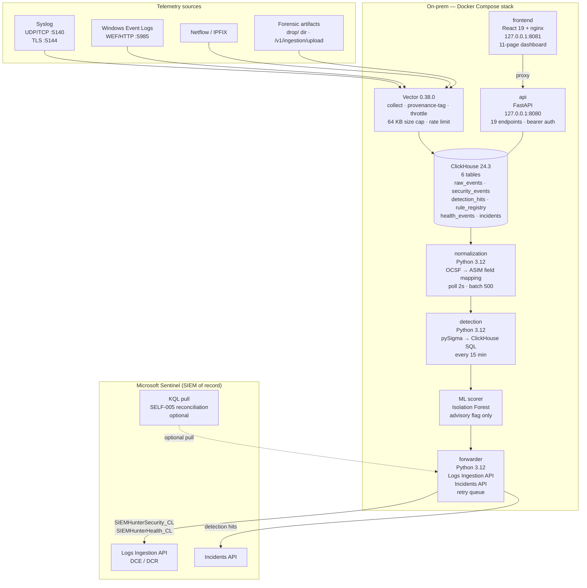

# SIEMhunter

**Lightweight on-premise security event collector and Microsoft Sentinel forwarder.**
Ingest syslog, Windows events, Netflow, and forensic artifacts — normalize to OCSF/ASIM, run Sigma and ML detections on a 15-minute batch cadence, and forward results to Sentinel. One `docker compose up` on any Linux host.

[](https://github.com/Philliamviber/SIEMhunter)
[](LICENSE)
[](https://docs.docker.com/compose/)
[](https://www.python.org/)

---

## Table of Contents

1. [What SIEMhunter Does](#what-siemhunter-does)
2. [Architecture](#architecture)
3. [v2.0 Feature Highlights](#v20-feature-highlights)
4. [Prerequisites](#prerequisites)
5. [Installation](#installation)
6. [Configure Log Sources](#configure-log-sources)
7. [Verify the Pipeline](#verify-the-pipeline)
8. [Dashboard](#dashboard)
9. [API Quick Reference](#api-quick-reference)
10. [Detection Rules](#detection-rules)
11. [Add Your Own Rules](#add-your-own-rules)
12. [Configuration Reference](#configuration-reference)
13. [Security Architecture](#security-architecture)
14. [Further Reading](#further-reading)
15. [Security Notes](#security-notes)
16. [Troubleshooting](#troubleshooting)
17. [Inspired By](#inspired-by)
18. [License](#license)

---

## What SIEMhunter Does

SIEMhunter is a **collector agent**, not a standalone SIEM. Sentinel remains the SIEM of record and the analyst's investigation surface. SIEMhunter handles the on-premise side: ingesting raw telemetry, normalizing it, running detections locally, and forwarding only the results.

```
[Telemetry sources]
  Syslog (UDP/TCP port 5140, TLS port 5144) ──────┐
  Windows Event Logs (WEF/HTTP port 5985)  ────────┤──► Vector ──► raw_events
  Netflow / IPFIX                          ────────┤              (ClickHouse, 1-day TTL)
  Forensic artifacts (drop/ dir or upload) ────────┘                    │
                                                              Normalization service
                                                              (polls every 2s, batch 500)
                                                              OCSF field mapping
                                                                         │
                                                              security_events
                                                              (ClickHouse, retention-days TTL)
                                                                         │
                                                              Detection service
                                                              (pySigma → SQL, every 15 min)
                                                                         │
                                                              ML scorer (Isolation Forest, advisory)
                                                                         │
                                                              detection_hits (ClickHouse, 90-day TTL)
                                                                         │
                                                              Forwarder ──────────────► Microsoft Sentinel
                                                              (every 15 min)            SIEMHunterSecurity_CL
                                                                                        SIEMHunterHealth_CL
                                                                                        Incidents API

Control plane:  FastAPI  (127.0.0.1:8080) — rule lifecycle, queries, status
Dashboard:      React    (127.0.0.1:8081) — 11-page dark security console
```

**What SIEMhunter is NOT:**

- Not a standalone SIEM — no analyst triage or case management; Sentinel owns that.
- Not real-time — batch detection only. The sole real-time exception is the Vector ingest-flood heuristic (SELF-002).
- Not internet-facing — the control plane is localhost-only; the forwarder is outbound HTTPS only.

---

## Architecture



**Seven services, one Docker Compose stack:**

| Service | Image | Role |
|---------|-------|------|
| `vector` | `ghcr.io/vectordotdev/vector:0.38.0` | Ingest edge: collect, provenance-tag, throttle, size-cap, write to ClickHouse staging |
| `clickhouse` | `clickhouse/clickhouse-server:24.3` | Local columnar store: 6 tables, detection backend, query engine |
| `normalization` | Python 3.12 (built) | Poll `raw_events`, apply OCSF field mapping, write `security_events` |
| `detection` | Python 3.12 (built) | Compile Sigma rules to ClickHouse SQL, run every 15 min, write `detection_hits` |
| `forwarder` | Python 3.12 (built) | Push to Sentinel via Logs Ingestion API + Incidents API; on-disk retry queue |
| `api` | Python 3.12 / FastAPI (built) | Control plane: rule lifecycle, queries, status, incidents, upload, search |
| `frontend` | React 19 + nginx (built) | Dark security dashboard at `http://127.0.0.1:8081`, auto-refreshes every 30s |

---

## v2.0 Feature Highlights

| Area | What's new in v2.0 |
|------|-------------------|
| Dashboard | 11-page dark console (4 new pages vs v1.0): Categories drill-down, Incidents list, Incident Detail, Entity Correlation graph |
| Incident management | Create, track, and close named incidents; scope file uploads to an incident |
| Forensic file upload | Drag-and-drop or API upload of `.json`, `.jsonl`, `.csv`, `.log`, `.txt` artifacts (max 100 MiB); strict allowlist mapping; ProvenanceTag always server-assigned |
| Claude AI narrative | Overview page: aggregated stats-only summary from Claude (never sends raw event data); optional, cached per batch cycle |
| Entity correlation | ECharts force-directed graph on `/correlation` — visualize relationships between IPs, hostnames, usernames, and processes |
| Global search | `POST /v1/search` with server-side field-type allowlist: IP, Hostname, Username, Port, EventID, FileHash (MD5/SHA-256 auto-detected), ProcessName |
| Ad-hoc SQL console | `/query` page with 6 pre-built templates; SELECT-only enforced server-side; 10K row cap, 30s timeout |
| Category drill-down | `/categories` — security domain breakdown: AD, Network, DNS, Malware, Log Analysis |
| API surface | 19 endpoints total; v2.0 adds metrics, ingestion summary, events, detections, incidents CRUD, upload, search |
| Test coverage | Vitest (frontend) + pytest (services) |

---

## Prerequisites

Before starting, confirm you have everything below.

**Runtime**
- [ ] Docker 24.x with the Compose plugin (`docker compose`, not `docker-compose`)
- [ ] Linux host or WSL2 — approximately 4 GB RAM available for Docker
- [ ] Git

**Azure**
- [ ] Azure subscription with a Log Analytics workspace and Microsoft Sentinel enabled
- [ ] **Push identity** — Azure app registration with an X.509 certificate; roles: `Monitoring Metrics Publisher` + `Microsoft Sentinel Contributor`
- [ ] **Pull identity** — Azure app registration with an X.509 certificate; role: `Log Analytics Reader` (required only if SELF-005 KQL reconciliation is enabled)
- [ ] Data Collection Endpoint (DCE) created in Azure Monitor
- [ ] Two Data Collection Rules (DCRs): one for `SIEMHunterSecurity_CL`, one for `SIEMHunterHealth_CL`
- [ ] Both PEM certificates exported from Azure (the push cert and, if used, the pull cert)

**Optional**
- [ ] Anthropic API key (`sk-ant-api03-...`) for the Claude AI summary on the Overview page

> **Credential note:** The forwarder authenticates to Azure using app registration + X.509 certificate. No client secrets are used. See `instructions/15-adr-forwarder-credential.md` for the full rationale.

---

## Installation

### Step 1 — Clone the repository

```sh
git clone https://github.com/Philliamviber/SIEMhunter.git
cd SIEMhunter
```

### Step 2 — Create the secrets directory

```sh
mkdir -p secrets
```

The `secrets/` directory is gitignored. Never commit files from it.

### Step 3 — Generate the ClickHouse password

```sh
echo "choose-a-strong-password" > secrets/clickhouse_password.txt
```

This password is used internally between containers only. It never leaves the Docker network.

### Step 4 — Generate the API bearer token

```sh
python3 -c "import secrets; print(secrets.token_hex(32))" > secrets/api_auth_token.txt
```

This token authenticates all API calls and the dashboard login prompt. Store it securely.

### Step 5 — Place your Sentinel certificates

Export your app registration certificates from Azure as PEM files, then copy them in:

```sh
# Push identity certificate (required — Logs Ingestion API + Incidents API)
cp /path/to/push-cert.pem secrets/forwarder_cert_push.pem

# Pull identity certificate (optional — only needed for SELF-005 KQL reconciliation)
cp /path/to/pull-cert.pem secrets/forwarder_cert_pull.pem
```

### Step 6 — Configure Sentinel endpoints

Edit `config/siemhunter.yaml`. The key fields are:

```yaml
sentinel:
  workspace_id: "your-workspace-guid"
  dce_uri: "https://your-dce.eastus.ingest.monitor.azure.com"
  tenant_id: "your-entra-tenant-guid"
  push_client_id: "your-push-app-registration-client-id"
  pull_client_id: "your-pull-app-registration-client-id"   # omit if not using SELF-005
  dcr_ids:
    SIEMHunterSecurity_CL: "/subscriptions/.../dataCollectionRules/..."
    SIEMHunterHealth_CL:   "/subscriptions/.../dataCollectionRules/..."
```

See `config/siemhunter.example.yaml` for a fully documented version of every key.

### Step 7 — (Optional) Enable the Claude AI summary

```sh
echo "sk-ant-api03-..." > secrets/anthropic_api_key.txt
```

If this file is absent, the Overview page shows "AI summary not available" and everything else works normally.

### Step 8 — Build and start the stack

```sh
docker compose up --build
```

On first start, ClickHouse runs the schema initialization script. Expect this in the logs:

```
clickhouse | Initialising SIEMhunter schema...
clickhouse | Schema initialised.
```

All seven services start in dependency order. Allow 30–60 seconds for ClickHouse to be fully ready before the Python services begin connecting.

### Step 9 — Verify the API is healthy

```sh
# Unauthenticated liveness probe
curl http://localhost:8080/v1/health
# Expected: {"status":"ok"}

# Authenticated pipeline status
TOKEN=$(cat secrets/api_auth_token.txt)
curl -H "Authorization: Bearer $TOKEN" http://localhost:8080/v1/status
# Expected: normalization_alive, detection_alive, forwarder_alive all true
```

### Step 10 — Open the dashboard

Navigate to `http://localhost:8081` in your browser. Paste the contents of `secrets/api_auth_token.txt` when the login prompt appears. The token is stored in browser `sessionStorage` only — it is cleared when the tab is closed.

### Step 11 — Send a test event

```sh
# Send a syslog UDP event to Vector
echo "Jun 20 09:00:00 testhost sshd[1234]: Accepted publickey for analyst from 10.0.0.10 port 22" \
  | nc -u localhost 5140

# After 2–5 seconds, verify it arrived in security_events
TOKEN=$(cat secrets/api_auth_token.txt)
curl -s -X POST http://localhost:8080/v1/query \
  -H "Authorization: Bearer $TOKEN" \
  -H "Content-Type: application/json" \
  -d '{"sql": "SELECT TimeGenerated, HostName, ChannelName, ProvenanceTag FROM siemhunter.security_events ORDER BY IngestTimestamp DESC LIMIT 5"}'
```

---

## Configure Log Sources

### Syslog (UDP, TCP, TLS)

Point your devices to the collector host:

| Transport | Address | Notes |
|-----------|---------|-------|
| UDP | `<collector-ip>:5140` | Most network devices |
| TCP | `<collector-ip>:5140` | Reliable delivery |
| TLS | `<collector-ip>:5144` | Encrypted; requires Vector TLS config |

### Windows Event Forwarding (WEF)

Configure a Windows Event Collector (WEC) subscription on your Domain Controller to push Security channel and Sysmon events to:

```
http://<collector-ip>:5985/
```

Recommended subscription events: Security (EID 4624, 4625, 4648, 4662, 4668, 4769, 4768, 4688) and Sysmon (EID 1, 3, 10). See `instructions/03-data-ingestion-spec.md` for the full recommended GPO subscription configuration.

### Netflow / IPFIX

Configure `softflowd` or your router/switch to export flow records to Vector's Netflow input. Example `softflowd` invocation:

```sh
softflowd -i eth0 -n <collector-ip>:2055 -v 9
```

### Forensic Artifacts (file drop)

Drop files from Velociraptor, Volatility, or any other forensic tool into the `drop/` directory on the host. Vector picks them up within seconds.

Supported formats: `.json`, `.jsonl`, `.csv`, `.log`, `.txt`

Alternatively, use the **Ingestion page** in the dashboard or `POST /v1/ingestion/upload` to upload files directly through the API. Files can be scoped to a named incident by passing `mode=incident&incident_id=<id>`.

---

## Verify the Pipeline

A full end-to-end check after setup:

```sh
TOKEN=$(cat secrets/api_auth_token.txt)

# 1. API liveness
curl http://localhost:8080/v1/health

# 2. Service status (all three *_alive should be true)
curl -H "Authorization: Bearer $TOKEN" http://localhost:8080/v1/status

# 3. Per-service health detail
curl -H "Authorization: Bearer $TOKEN" http://localhost:8080/v1/health/normalization
curl -H "Authorization: Bearer $TOKEN" http://localhost:8080/v1/health/detection
curl -H "Authorization: Bearer $TOKEN" http://localhost:8080/v1/health/forwarder

# 4. Ingestion metrics
curl -H "Authorization: Bearer $TOKEN" http://localhost:8080/v1/ingestion/summary

# 5. Detection hits (empty until first batch cycle completes)
curl -H "Authorization: Bearer $TOKEN" http://localhost:8080/v1/detections
```

Health is reported via alive-file recency for `normalization`, `detection`, and `forwarder` (threshold: 5 minutes). ClickHouse status is verified via `SELECT 1`. Vector reports as `unknown` — check container logs or `docker ps` directly.

---

## Dashboard

Served at `http://localhost:8081`. All pages auto-refresh every 30 seconds.

| Page | Route | What it shows |
|------|-------|---------------|
| Overview | `/` | KPI cards (events 24h, hits 24h, active rules, last batch, forward status); Claude AI security narrative; anomaly score histogram; recent high/critical hits |
| Events | `/events` | Filterable, paginated table of `security_events` (30-day window); slide-in detail panel per row; filters: time range, hostname, EventID, username, source IP, provenance tag |
| Detections | `/detections` | Detection hit timeline (stacked area by severity); facet sidebar (severity, rule, forwarded status); rule detail panel |
| Rules | `/rules` | Kanban board showing rule lifecycle (draft → test → review → production → disabled); Sigma YAML viewer; fail-closed status changes |
| Ingestion | `/ingestion` | Source breakdown donut; event volume per hour per source; per-source health cards; manual file upload zone |
| Health | `/health` | Per-service status grid; self-detection rule board (SELF-001 through SELF-005); retry queue depth |
| Query | `/query` | Ad-hoc `SELECT` console against ClickHouse; SELECT-only enforced server-side; 6 pre-built query templates |
| Categories | `/categories` | Security domain drill-down: Active Directory, Network, DNS, Malware, Log Analysis |
| Incidents | `/incidents` | Create and list named incidents (severity: low/medium/high/critical; status: open/closed/archived) |
| Incident Detail | `/incidents/:id` | Per-incident event list; file upload scoped to the incident; notes |
| Correlation | `/correlation` | ECharts force-directed entity relationship graph: IPs, hostnames, usernames, processes |

### Dashboard access

The dashboard prompts for the bearer token on first load. The token is stored in browser `sessionStorage` — closing the tab clears it; the browser's back-forward cache does not persist it.

### AI Summary

The Overview page includes a "Get AI Summary" card powered by Claude. To enable it, place your Anthropic API key in `secrets/anthropic_api_key.txt` and restart the `api` service:

```sh
docker compose restart api
```

What Claude receives: **aggregated statistics only** — event counts by source, detection hit counts by severity and rule name, anomaly score buckets, health deltas. Raw event data (CommandLine, usernames, IPs, hostnames) is never sent. The summary is cached per 15-minute batch cycle.

---

## API Quick Reference

All endpoints are at `http://localhost:8080`. All except `GET /v1/health` require `Authorization: Bearer <token>`.

Error responses use the shape: `{"detail": {"error": "...", "code": "..."}}`

| Method | Path | Auth | Description |
|--------|------|:----:|-------------|
| `GET` | `/v1/health` | No | Docker liveness probe — always returns `{"status":"ok"}` |
| `GET` | `/v1/status` | Yes | Pipeline status: service alive flags, pending retry queue depth |
| `GET` | `/v1/health/{service}` | Yes | Per-service detail for `vector`, `clickhouse`, `normalization`, `detection`, `forwarder` |
| `POST` | `/v1/query` | Yes | Execute a `SELECT` against ClickHouse; 10K row cap, 30s timeout, SSRF blocked, no writes |
| `GET` | `/v1/rules` | Yes | List all rules from `rule_registry` |
| `GET` | `/v1/rules/{id}` | Yes | Get one rule's current status |
| `PUT` | `/v1/rules/{id}/status` | Yes | Promote or demote rule lifecycle status (fail-closed: Sentinel audit written first) |
| `GET` | `/v1/metrics` | Yes | Event counts, detection hit counts, anomaly histogram, last batch timestamp |
| `GET` | `/v1/ingestion/summary` | Yes | Provenance breakdown, volume per hour, latency p95, per-source health cards |
| `GET` | `/v1/events` | Yes | Paginated, filterable `security_events` (30-day window) |
| `GET` | `/v1/detections` | Yes | Paginated, filterable `detection_hits` with severity timeline |
| `GET` | `/v1/ai/summary` | Yes | Claude AI narrative from aggregated stats; cached per batch cycle |
| `POST` | `/v1/incidents` | Yes | Create a named incident (fields: `name`, `description`, `severity`) |
| `GET` | `/v1/incidents` | Yes | List all incidents ordered by creation time (newest first) |
| `GET` | `/v1/incidents/{id}` | Yes | Get a single incident by ID |
| `PATCH` | `/v1/incidents/{id}/status` | Yes | Update incident status (`open`, `closed`, `archived`) |
| `POST` | `/v1/ingestion/upload` | Yes | Upload a forensic artifact file (max 100 MiB; `.json`, `.jsonl`, `.csv`, `.log`, `.txt`) |
| `POST` | `/v1/search` | Yes | Field-type search: `IP`, `Hostname`, `Username`, `Port`, `EventID`, `FileHash`, `ProcessName` |

### Example: ad-hoc query

```sh
TOKEN=$(cat secrets/api_auth_token.txt)

curl -s -X POST http://localhost:8080/v1/query \
  -H "Authorization: Bearer $TOKEN" \
  -H "Content-Type: application/json" \
  -d '{
    "sql": "SELECT RuleId, Severity, count() as hits FROM siemhunter.detection_hits WHERE DetectedAt > now() - INTERVAL 24 HOUR GROUP BY RuleId, Severity ORDER BY hits DESC LIMIT 20"
  }'
```

### Example: field-type search

```sh
curl -s -X POST http://localhost:8080/v1/search \
  -H "Authorization: Bearer $TOKEN" \
  -H "Content-Type: application/json" \
  -d '{
    "field_type": "IP",
    "value": "10.0.0.50",
    "start": "2026-06-19T00:00:00Z"
  }'
```

---

## Detection Rules

SIEMhunter ships with 11 Sigma rules split across two categories. Self-detection rules are promoted to `production` status before any Windows/AD rule.

### Self-detection (5 rules)

SIEMhunter watches its own security posture first.

| Rule ID | Name | What it detects |
|---------|------|-----------------|
| SELF-001 | CertAnomalyDetected | Service principal authenticates to Sentinel from an IP outside the 30-day baseline |
| SELF-002 | IngestFloodDetected | Vector flood heuristic fired — events/sec per `ProvenanceTag` exceeded threshold for 60 consecutive seconds |
| SELF-003 | RuleDisableAudit | A Sigma rule status was changed via the API control plane (audit written to Sentinel before ClickHouse update) |
| SELF-004 | DecompressionCapTrip | A forensic artifact exceeded the decompression ratio cap (default 20:1) |
| SELF-005 | LedgerReconciliationDelta | Forwarded event count (local ledger) does not match the count received in Sentinel at end of batch |

> **SELF-003 invariant:** The Sentinel audit record is written *before* the ClickHouse status change. If Sentinel is unreachable, the status change is rejected (HTTP 503). Any rule disable that does not appear in `SIEMHunterSecurity_CL` is evidence of a bypass attempt.

### Windows / Active Directory TTPs (6 rules)

| Rule ID | MITRE | What it detects |
|---------|-------|-----------------|
| windows-ad-001 | T1558.003 | Kerberoasting — EID 4769, RC4 encryption (`0x17`/`0x18`), non-machine accounts |
| windows-ad-002 | T1558.004 | AS-REP Roasting — EID 4768, no pre-authentication required, user accounts |
| windows-ad-003 | T1003.006 | DCSync — EID 4662, `DS-Replication-Get-Changes` right |
| windows-ad-004 | T1003.001 | LSASS access — Sysmon EID 10, `GrantedAccess=0x1010` |
| windows-ad-005 | T1021.002 | SMB lateral movement — `services.exe` spawning `cmd.exe` or `powershell.exe` |
| windows-ad-006 | T1021.001 | RDP lateral movement — Sysmon network connection + logon type 10 |

Rules are stored in `rules/local/`. Each rule's `status` field controls whether it runs and whether hits are forwarded to Sentinel.

---

## Add Your Own Rules

### Rule lifecycle

```
draft  ──►  test  ──►  review  ──►  production  ──►  disabled
  (skip)    (run,        (run,        (run +
            no fwd)      no fwd)      forward)
```

- `draft` — skipped entirely by the detection service.
- `test` — rule runs, hits are written to `detection_hits`, but the forwarder does not send them to Sentinel.
- `review` — same as `test`; signals the rule is ready for peer review.
- `production` — runs and forwards hits to `SIEMHunterSecurity_CL` and the Incidents API.
- `disabled` — skipped. Any transition to or from `disabled` or `production` generates a High-severity audit record in Sentinel.

### Directory layout

```
rules/
  local/
    windows_ad/          # place custom Windows/AD rules here
    self_detection/      # built-in self-detection rules (do not modify)
  pipelines/
    clickhouse-asim-ocsf.yaml   # pySigma schema contract (authoritative field map)
```

The detection service hot-reloads rules from disk on every 15-minute cycle. No container restart is needed after adding or editing a rule file.

### Minimal rule template

```yaml
title: My Custom Rule
id: local-001                  # unique; use a UUID or descriptive slug
status: draft                  # start as draft; promote via dashboard or API
description: |
  What this rule detects and why.
author: your-name
date: 2026-06-20
logsource:
  product: windows
  service: security
detection:
  selection:
    EventID: 4625              # example: failed logon
  condition: selection
fields:
  - TimeGenerated
  - SubjectUserName
  - IpAddress
falsepositives:
  - Expected scenarios that generate false positives
level: medium                  # informational | low | medium | high | critical
tags:
  - attack.credential-access
custom:
  rule_id: local-001
  mitre_tag: "T1110"
```

Save the file to `rules/local/windows_ad/my_custom_rule.yaml`. It will be picked up on the next detection cycle.

### Promote a rule via the API

```sh
TOKEN=$(cat secrets/api_auth_token.txt)

# Move from draft to test
curl -s -X PUT http://localhost:8080/v1/rules/local-001/status \
  -H "Authorization: Bearer $TOKEN" \
  -H "Content-Type: application/json" \
  -d '{"new_status": "test", "reason": "initial testing"}'

# Move to production (triggers Sentinel audit write first)
curl -s -X PUT http://localhost:8080/v1/rules/local-001/status \
  -H "Authorization: Bearer $TOKEN" \
  -H "Content-Type: application/json" \
  -d '{"new_status": "production", "reason": "reviewed and approved"}'
```

Or use the **Rules** page in the dashboard (Kanban board) — same fail-closed audit sequence applies.

For the full field name reference and pySigma pipeline contract, see `rules/RULES_README.md` and `rules/pipelines/clickhouse-asim-ocsf.yaml`.

---

## Configuration Reference

All non-secret configuration lives in `config/siemhunter.yaml`. Key fields:

| Key | Default | Description |
|-----|---------|-------------|
| `detection.interval_seconds` | `900` | Batch detection cadence (900 = 15 min) |
| `detection.anomaly_threshold` | `0.8` | Isolation Forest score threshold for advisory anomaly flag |
| `detection.pipeline` | `/app/rules/pipelines/clickhouse-asim-ocsf.yaml` | pySigma field mapping pipeline |
| `detection.rules_dir` | `/app/rules/local` | Directory containing local Sigma rules |
| `ingest.rate_limit_events_per_min` | `10000` | Per-source rate limit at the normalization layer |
| `ingest.decomp_ratio_cap` | `20` | Max decompression ratio before SELF-004 fires |
| `ingest.parse_timeout_seconds` | `5` | Per-event parse timeout |
| `forwarding.max_retries` | `5` | Retry attempts before moving batch to on-disk retry queue |
| `forwarding.retry_initial_backoff_seconds` | `10` | Initial retry backoff (doubles each attempt, capped at 300s) |
| `forwarding.retry_queue_path` | `/app/retry_queue` | On-disk retry queue path (persisted across restarts) |
| `forwarding.kql_pull_enabled` | `false` | Enable SELF-005 KQL reconciliation pull from Sentinel |

Full reference with comments: `config/siemhunter.example.yaml`

---

## Security Architecture

### Network segmentation

Three Docker networks isolate traffic by trust zone:

| Network | Who uses it | Allowed traffic |
|---------|-------------|-----------------|
| `ingest` | Vector only | Host-facing: receives syslog, WEF, Netflow from the LAN |
| `internal` | ClickHouse + all Python services + frontend | Internal only: no external routing |
| `egress` | `forwarder` + `api` | Outbound HTTPS only (Sentinel + Anthropic); no inbound |

### Container hardening

Every container runs with:

```yaml
cap_drop: [ALL]
security_opt: [no-new-privileges:true]
read_only: true          # root filesystem
user: <non-root UID>
```

### Secrets management

All runtime credentials are passed via Docker secrets (mounted as `tmpfs` in-memory files). Environment variables are never used for secrets. The `secrets/` directory is gitignored.

| Secret file | What it contains |
|-------------|-----------------|
| `secrets/clickhouse_password.txt` | ClickHouse internal password |
| `secrets/api_auth_token.txt` | API bearer token |
| `secrets/forwarder_cert_push.pem` | X.509 certificate for the push app registration |
| `secrets/forwarder_cert_pull.pem` | X.509 certificate for the pull app registration (optional) |
| `secrets/anthropic_api_key.txt` | Anthropic API key (optional) |

### API security controls

- Binds `127.0.0.1:8080` only — never `0.0.0.0`.
- Bearer token comparison uses constant-time comparison to prevent timing attacks.
- OpenAPI docs are disabled in production (`/docs` and `/redoc` are inaccessible).
- `POST /v1/query` enforces SELECT-only at the server (no DDL, DML, or system commands); additionally blocks SSRF via URL validation; 10K row cap; 30s execution timeout.
- `POST /v1/search` uses a server-side column allowlist — the column name is never interpolated from the request body.

### Fail-closed rule audit

Rule status changes (`PUT /v1/rules/{id}/status`) follow a strict sequence:

1. Validate the requested status.
2. Build an audit record (`EventType: RuleChangeAudit`).
3. Write the audit record to `SIEMHunterSecurity_CL` — synchronously.
4. **If step 3 fails, return HTTP 503 and make no ClickHouse change.**
5. Apply the status change to `siemhunter.rule_registry`.

Sentinel sees the audit record before ClickHouse is updated. A rule disable that does not appear in `SIEMHunterSecurity_CL` is evidence of a bypass attempt (SELF-003).

### Forwarder credential model

The forwarder uses app registration + X.509 certificate authentication. No client secrets exist. Certificates are mounted from Docker secrets at runtime.

---

## Further Reading

| Document | For |
|----------|-----|
| [ARCHITECTURE.md](ARCHITECTURE.md) | Detailed dataflow, service responsibilities, trust boundaries, network topology |
| [API.md](API.md) | Complete endpoint reference with curl examples and response schemas |
| [DASHBOARD.md](DASHBOARD.md) | Dashboard user guide, keyboard shortcuts, pre-built query templates |
| [DEPLOYMENT.md](DEPLOYMENT.md) | Production deployment, TLS setup, secrets management, scaling |
| [DEVELOPMENT.md](DEVELOPMENT.md) | Local dev setup, debugging, adding rules, running ClickHouse queries directly |
| [TROUBLESHOOTING.md](TROUBLESHOOTING.md) | Common failures and diagnostics |
| [rules/RULES_README.md](rules/RULES_README.md) | Rule schema, authoring guide, field name reference, pySigma pipeline contract |
| `instructions/16-hardening-checklist.md` | Pre-production security checklist |
| `instructions/14-threat-model.md` | Threat model and trust boundary analysis |
| `instructions/15-adr-forwarder-credential.md` | Architecture decision: X.509 certificate auth for the forwarder |

---

## Security Notes

- `.env`, `*.pem`, `*.key`, `*.p12`, `*.pfx`, and `secrets/*` are gitignored. Never commit credentials.
- Run `gitleaks` or `truffleHog` as a pre-push gate. See `instructions/09-security-and-iam.md`.
- The forwarder is the only service with outbound egress to Azure. The `api` service has outbound egress to the Anthropic API only when the AI summary key is present. All other services are network-isolated.
- The dashboard token is stored in browser `sessionStorage` only — not `localStorage`, not cookies. It is cleared on tab close.
- Vector applies a 64 KB per-event size cap and a configurable per-source rate limit. Decompression ratio is capped at 20:1 (SELF-004). These are the primary defenses against ingest-based denial of service.
- The upload endpoint (`POST /v1/ingestion/upload`) enforces a strict allowlist of canonical field names. `ProvenanceTag` and `IngestTimestamp` are always server-assigned and cannot be supplied by file content.
- For a red-team attacker's-eye analysis of SIEMhunter's own attack surface, see `advise.md`. That analysis defines Phase 5 red-team activity, which runs **after the system is built** and is **authorization-gated**.

---

## Troubleshooting

**ClickHouse not ready at startup**

The Python services retry on startup, but if they fail immediately, wait 30–60 seconds and run:

```sh
docker compose restart normalization detection forwarder api
```

**No events appearing in `security_events`**

1. Check that Vector received the event: `docker compose logs vector`
2. Check that normalization is processing: `docker compose logs normalization`
3. Verify the provenance tag is being set: query `raw_events` directly via `POST /v1/query`

**Forwarder retry queue growing**

Indicates Sentinel is unreachable or the DCE/DCR configuration is incorrect. Check:

```sh
docker compose logs forwarder
curl -H "Authorization: Bearer $TOKEN" http://localhost:8080/v1/status
```

The retry queue is persisted to disk (named Docker volume) and survives container restarts. Batches are retried with exponential backoff (initial 10s, max 300s, up to 5 attempts before queuing).

**Rule status change returns HTTP 503**

The Sentinel audit write failed. The rule status was not changed. Check forwarder connectivity to the DCE URI. Fix the connectivity issue and retry.

**`POST /v1/query` returns a permissions error**

The API enforces SELECT-only. Queries containing `INSERT`, `UPDATE`, `DELETE`, `DROP`, `CREATE`, or `ALTER` are rejected with a descriptive error.

---

## Inspired By

[HELK](https://github.com/Cyb3rWard0g/HELK) (Hunting ELK stack by Roberto Rodriguez) — SIEMhunter takes the same "analyst-friendly hunting platform" philosophy but is lighter, Sentinel-native, and built around a batch detection model rather than a self-contained SIEM stack.

---

## License

MIT. See [LICENSE](LICENSE).

---

## Contributing

No formal contributing guide yet. If you are working from this codebase, the design spec reading order is `instructions/00-orchestration-plan.md` → the numbered instruction files in sequence. The full rule authoring guide is `rules/RULES_README.md`.
