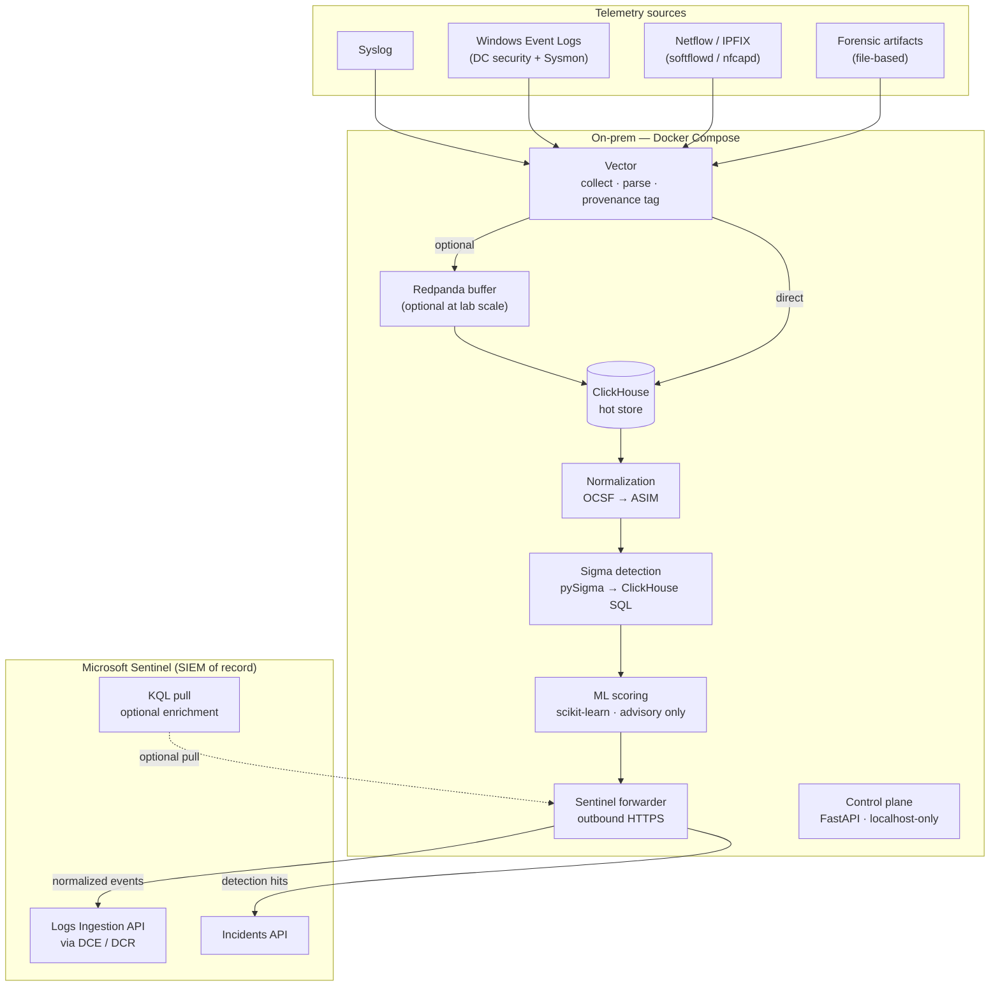

# SIEMhunter

> Lightweight on-premise security event collector and Sentinel forwarder.
> Ingest → normalize → detect → forward.

**Status:** Design phase · v0.1.0 docs in progress · No application code yet

---

## What it is

SIEMhunter is an **on-premise collector agent**, not a standalone SIEM. It sits
close to your lab network, ingests security telemetry from multiple sources,
normalizes everything to OCSF/ASIM, runs batch Sigma and baseline ML detections,
then forwards normalized events and detection hits to **Microsoft Sentinel** —
which remains the SIEM of record and the analyst's investigation surface.

Detection runs on a **15–60 minute batch cadence**, which removes the cost and
fragility of a real-time pipeline while still surfacing threats within an
investigation-friendly window. Deployment is a single `docker compose up` on
any on-premise Linux host.

**What it is NOT:**
- Not a standalone SIEM — no analyst console; Sentinel owns triage and case management
- Not real-time — batch detection only (one real-time exception: the ingest-flood heuristic)
- Not internet-facing — the control plane is localhost-only; the forwarder is outbound HTTPS only

---

## Architecture



> **Key:** OCSF = Open Cybersecurity Schema Framework · ASIM = Advanced Security
> Information Model (Sentinel's normalized schema) · DCE/DCR = Data Collection
> Endpoint / Data Collection Rule · KQL = Kusto Query Language

---

## v0.1.0 Scope

### In scope

| Area | Detail |
|------|--------|
| Ingestion | Syslog, Windows Event Logs (DC security + Sysmon), Netflow/IPFIX, forensic artifacts |
| Local store | ClickHouse |
| Normalization | OCSF → ASIM mapping layer |
| Detections | Batch Sigma rules (pySigma → ClickHouse SQL) |
| ML | Baseline anomaly scoring — Isolation Forest + z-score (advisory; never fires incidents independently) |
| Self-detections | 5 built-in rules covering SIEMhunter's own attack surface (ship first) |
| Windows/AD TTPs | Kerberoasting, AS-REP Roasting, DCSync, LSASS access, lateral movement |
| Sentinel forwarding | Logs Ingestion API (DCE/DCR) + Incidents API |
| Control plane | FastAPI, localhost-only, authenticated |
| Deployment | Docker Compose, on-premise |

### Deferred (not in v0.1.0)

AI/LLM detection · OWASP web-layer TTPs · APT multi-stage correlation ·
OpenSearch · PCAP/memory forensics · Real-time streaming · Multi-tenant RBAC ·
Reporting UI

---

## Self-detections

SIEMhunter monitors its own security posture before it monitors anything else.
These five rules reach production status before any Windows/AD rule is promoted.

| Rule ID | Name | What it detects |
|---------|------|-----------------|
| SELF-001 | CertAnomalyDetected | Service principal authenticates to Sentinel from an IP outside the 30-day baseline |
| SELF-002 | IngestFloodDetected | Vector flood heuristic fired (events/sec per source exceeded threshold for 60 s) |
| SELF-003 | RuleDisableAudit | A Sigma rule was disabled or modified via the FastAPI control plane |
| SELF-004 | DecompressionCapTrip | A forensic artifact exceeded the decompression ratio cap |
| SELF-005 | LedgerReconciliationDelta | Forwarded event count (local ledger) does not match received count in Sentinel at end of batch |

---

## Repository layout

```
SIEMhunter/
├── README.md
├── advise.md                          — red-team advisory (for ad-redteamer Phase 5)
├── .gitignore
├── instructions/                      — planning + spec documents (Claude-readable)
│   ├── 00-orchestration-plan.md       — master multi-agent build plan (start here)
│   ├── 01-architecture-overview.md
│   ├── 02-requirements.md
│   ├── 03-data-ingestion-spec.md
│   ├── 04-normalization-and-schema.md
│   ├── 05-detection-and-anomaly.md
│   ├── 06-api-control-plane.md
│   ├── 07-sentinel-forwarding.md
│   ├── 08-deployment-hybrid.md
│   ├── 09-security-and-iam.md
│   ├── 10-acceptance-criteria.md
│   ├── 11-glossary.md
│   ├── 12-data-retention-and-lifecycle.md
│   ├── 13-agent-task-matrix.md
│   ├── 14-threat-model.md
│   ├── 15-adr-forwarder-credential.md
│   └── 16-hardening-checklist.md
└── rules/
    ├── pipelines/
    │   └── clickhouse-asim-ocsf.yaml  — pySigma schema contract (authoritative field map)
    ├── [local/]                        — planned
    │   ├── [self_detection/]           — 5 built-in self-detections
    │   └── [windows_ad/]              — Kerberoasting, DCSync, LSASS, lateral movement
    ├── [sigma/]                        — planned: pinned SigmaHQ community snapshot
    ├── [compiled/]                     — generated (gitignored)
    └── [tests/]                        — planned: positive + negative sample events
```

Items in `[brackets]` under `rules/` are planned but not yet created; all `instructions/` files now exist.

---

## Getting started (design phase)

No application code exists yet. To understand the project, read the spec documents
in order:

```sh
# Master plan — who builds what, in what order
cat instructions/00-orchestration-plan.md

# Architecture — data flow, component table, trust boundaries
cat instructions/01-architecture-overview.md

# Definition of done
cat instructions/10-acceptance-criteria.md
```

The `instructions/` directory is structured for consumption by Claude Code
subagents. Each file declares its own audience, gate dependencies, and owner.

---

## Security notes

- `.env`, `*.pem`, `*.key`, `*.p12`, `*.pfx` are gitignored; never commit secrets
- All runtime credentials pass through **Docker secrets** (mounted as tmpfs)
- Forwarder authenticates to Azure via **app registration + certificate** — no client secrets
- The FastAPI control plane is **localhost-only** and requires authentication
- A gitleaks / truffleHog CI gate is required before the build phase begins (see `instructions/09-security-and-iam.md`)

---

## Red-team advisory

`advise.md` contains an attacker's-eye analysis of SIEMhunter's attack surface
and five handoff objectives for the `ad-redteamer` agent. That advisory defines
**Phase 5**, which runs **after the system is built** and is **authorization-gated**.
Do not invoke any red-team activity during the design or build phases.

---

## Inspired by

[HELK](https://github.com/Cyb3rWard0g/HELK) (Hunting ELK stack) — SIEMhunter is
lighter and Sentinel-native rather than self-contained.

---

## License

See LICENSE (TBD). No contributing guide yet — docs phase.
