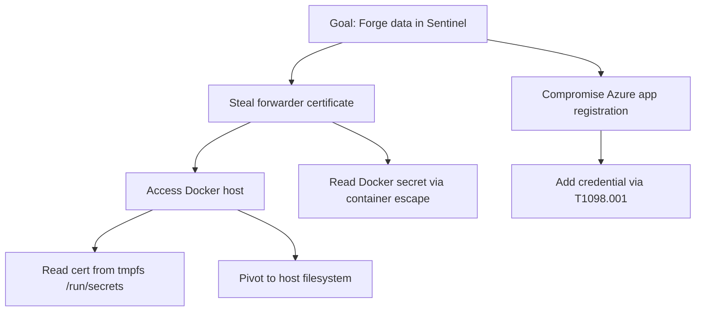
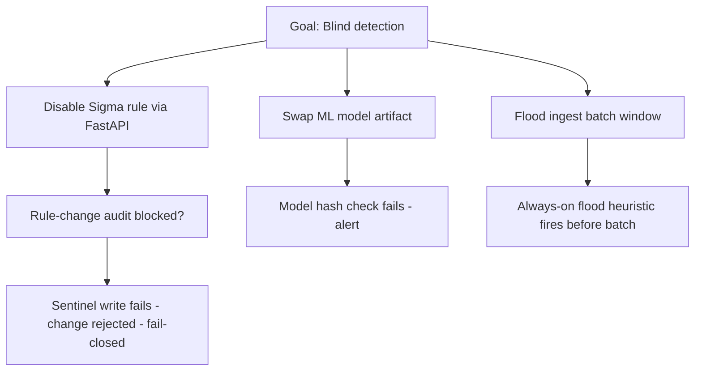

> **SUPERSEDED** — This red-team advisory was a planning-phase artifact (originally at repo root
> as `advise.md`). It has been relocated to `docs/history/` for reference only.
> Current planning lives in `docs/newreleaseplan/proposalplan.md` and `docs/plan.md`.

# SIEMhunter — Red-Team Advisory (`ad-redteamer`)

> **Audience.** The `ad-redteamer` agent.
> **Posture.** This is an attacker's-eye analysis of SIEMhunter. It exists to tell
> the red teamer *how this infrastructure can be exploited* and what to probe once
> the system is built.
>
> **Timing.** This advisory is executed in **Phase 5 — after the system is built**.
> **Do NOT invoke any red-team activity now.** See the authorization gate (Section 7).
>
> Acronyms on first use: **SP** = service principal; **DCE/DCR** = Data Collection
> Endpoint / Data Collection Rule; **IMDS** = Instance Metadata Service;
> **WEF** = Windows Event Forwarding; **ASIM** = Advanced Security Information Model.

---

## 1. Adversary Model

| Actor | Initial access | Goal |
|-------|----------------|------|
| **External log-feeder** | Controls a syslog / WEF source SIEMhunter ingests | Parser exploit or data injection |
| **Host-landed attacker** | Code execution on the Docker host | Cert theft → Sentinel forgery → hide tracks |
| **Insider / compromised analyst** | Authenticated FastAPI access | Disable detection, manipulate rules |

---

## 2. Kill-Chain Categories

### 1. Ingestion as weapon
Craft a zip-bomb or oversized event to exhaust the parser; inject hostile payloads
via log **field values** (SQL/identifier injection into ClickHouse, provenance
spoofing via source-supplied identity fields). Probe the **parser timeout** — a
slow-parse payload that stalls the pipeline during a batch window creates a
detection blind spot. Test whether any source-supplied hostname/IP is trusted as
identity rather than the collector-assigned provenance tag.

### 2. Certificate theft → Sentinel pivot
Read the Docker secret directly from **tmpfs** (`/run/secrets`), or from the host
filesystem if the cert was bind-mounted instead of mounted as a secret. With the
stolen cert, authenticate as the app registration and **push forged events** into
Sentinel via the Logs Ingestion API, and **forge incidents** via the Incidents
API. Goal: pollute the SIEM with attacker-chosen narrative or bury real signal.

### 3. Hybrid-identity pivot
Use the on-prem Docker host as the launch point: steal the cert → authenticate to
Entra as the SP → attempt **T1098.001 (Add credential to app/SP)** for durable
persistence → pivot from on-prem into the Azure tenant. Test whether the SP's real
permissions exceed the stated DCR-only push scope.

### 4. Control-plane abuse
Exploit FastAPI endpoints (assuming insider access or a localhost foothold):
disable Sigma rules, change forwarder configuration, and attempt **SSRF** to reach
IMDS `169.254.169.254` or other internal endpoints from the control plane.

### 5. Supply-chain attack
Swap the **pinned SigmaHQ snapshot** for a tampered one, or inject a malicious rule
that quietly creates a blind spot (over-broad exclusion). Swap the **ML model
artifact** to neuter anomaly detection. Test whether hash verification and the
fail-closed audit actually block these.

### 6. Container breakout
Exploit the container runtime to pivot to the host; access the **Docker socket** if
it was mounted into a container; read secrets from the host once escaped. The host
is the path to the cert and therefore to Sentinel.

---

## 3. Attack Trees

### Tree 1 — Forge / tamper data in Sentinel



### Tree 2 — Disable / blind detection



---

## 4. Prioritized Findings

| # | Finding | Likelihood | Impact | Mitigation | Self-detection SIEMhunter should ship |
|---|---------|-----------|--------|-----------|--------------------------------------|
| 1 | Cert theft → Sentinel forgery | High | Critical | Docker secrets + chmod 400 + Key Vault v0.2 | 2nd-IP on SP (cert/2nd-IP self-detection) |
| 2 | Log injection via crafted syslog field | High | High | Parameterized inserts + provenance tag | Decompression-ratio anomaly |
| 3 | T1098.001 credential-add to app reg | Medium | Critical | App-reg owner minimization + Entra AuditLogs + KQL | Credential-add detection (SIEMHunterSecurity_CL) |
| 4 | Batch-window flood (blind 15–60 min) | High | High | Always-on Vector flood heuristic | Ingest-flood self-detection |
| 5 | Rule disable without trace | Medium | High | Fail-closed audit → Sentinel | Rule-disable audit self-detection |
| 6 | Ledger gap (Sentinel forgery/loss) | Low | Critical | Ledger reconciliation + egress IP self-report | Ledger-reconciliation self-detection |
| 7 | Zip-bomb / decompression attack | Medium | High | Decompression-ratio cap per source | Decompression-ratio cap trip |
| 8 | ML model artifact swap | Low | Medium | Hash verify on load; no pickle from untrusted path | Model-load integrity alert |
| 9 | SSRF via FastAPI → IMDS | Low | High | Block 169.254.169.254 outbound | SSRF attempt log |
| 10 | Container escape → host cert | Low | Critical | cap_drop ALL; no-new-privileges; userns-remap | Container anomaly (no direct self-detect) |
| 11 | Identifier injection (rule metadata as SQL column) | Medium | High | Whitelist/validate rule metadata before SQL use | N/A (build-time gate) |
| 12 | Entra diagnostic settings missing → silent zero detections | High | High | Prereq checklist + hardening gate | N/A (prereq) |
| 13 | Docker socket mounted by container | Low | Critical | Explicit no-Docker-socket policy in Compose | N/A (config gate) |

---

## 5. Red-Team Handoff Objectives

For the `ad-redteamer` agent to execute **against the built system, with authorization**:

1. **Forwarder SP blast-radius enumeration.** Determine the forwarder service
   principal's *true* effective permissions in Azure. Does it actually have only
   `Monitoring Metrics Publisher` on the DCR (push) and `Log Analytics Reader` at
   workspace scope (pull), or has scope crept beyond the stated design?
2. **T1098.001 persistence test.** Attempt to add a new credential to the SP. Does
   it succeed, and does the cert/2nd-IP credential-add self-detection fire?
3. **Synthetic event forgery + ledger reconciliation test.** With a stolen
   certificate, push forged events into Sentinel. Does the ledger-reconciliation
   self-detection (#6) detect the delta between local ledger and Sentinel counts?
4. **On-prem → cloud pivot via host identity / IMDS.** From the Docker host, can
   IMDS `169.254.169.254` be reached? Can any host-attached managed identity be
   leveraged to reach Azure resources beyond the forwarder's scope?
5. **Reader-identity workspace recon.** Using the `Log Analytics Reader` identity,
   what data is visible? Can it enumerate other workspaces or tenants, or only the
   intended SIEMhunter workspace?

---

## 6. ASIM / KQL Self-Detection Sketches

Starting points for the detection engineer — refine before production use.

**Finding #1 — cert theft / 2nd IP on the SP**
```kql
// Sign-ins from the forwarder SP outside the known egress IP list
SigninLogs
| where AppId == "<forwarder-app-id>"
| where IPAddress !in (dynamic(["<known-egress-ip-1>", "<known-egress-ip-2>"]))
| project TimeGenerated, AppId, IPAddress, ResultType, Location
```
```kql
// Credential added to the app registration / SP (T1098.001)
AuditLogs
| where OperationName has "Add" and OperationName has_any ("credential", "key", "certificate")
| where TargetResources has "<forwarder-app-id>"
| project TimeGenerated, OperationName, InitiatedBy, TargetResources
```

**Finding #4 — ingest flood**
In the Vector pipeline: if events-per-second exceeds the configured threshold for
60 seconds, emit a self-event to `SIEMHunterHealth_CL`:
```kql
SIEMHunterHealth_CL
| where EventType_s == "IngestFlood"
| project TimeGenerated, Source_s, EventsPerSecond_d, WindowSeconds_d
```

**Finding #6 — ledger reconciliation**
Compare events forwarded (local append-only ledger, surfaced as a count event) vs.
events received in the Sentinel custom table for the same window; any positive
delta → alert to `SIEMHunterSecurity_CL`:
```kql
let window = 1h;
let local = SIEMHunterHealth_CL
    | where EventType_s == "LedgerCount" and TimeGenerated > ago(window)
    | summarize Forwarded = sum(EventCount_d);
let received = SIEMHunterSecurity_CL
    | where TimeGenerated > ago(window)
    | summarize Received = count();
local | extend Received = toscalar(received)
      | extend Delta = Forwarded - Received
      | where Delta > 0
```

---

## 7. Authorization Gate

The `ad-redteamer` agent executes the objectives in Section 5 **ONLY** against the
user's own infrastructure, **with explicit authorization**, and **after the system
is built (Phase 5)**. **Do not execute now.** This document is advisory; it confers
no authorization by itself. Any live testing requires the user's explicit go-ahead
for the specific scope and time window.
