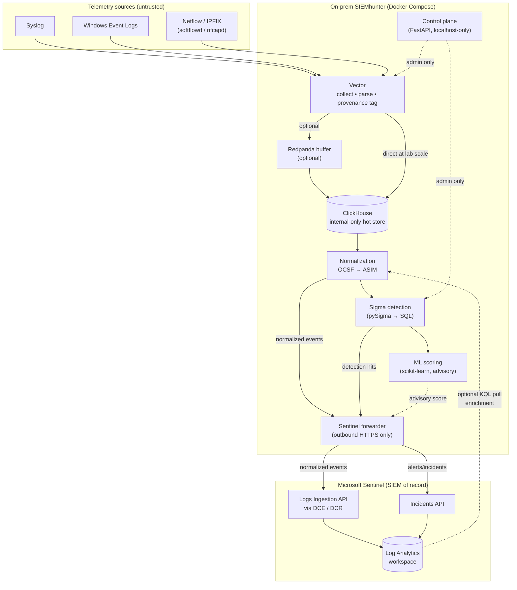

# SIEMhunter — Architecture Overview

> **Status:** Authoritative design document for v0.1.0
> **Audience:** Engineers, reviewers, and operators of SIEMhunter
> **Scope:** This document defines the system architecture, data flow, trust boundaries, and security design principles. Implementation details live in the referenced companion documents.

---

## 1. Architecture overview

SIEMhunter is a **lightweight on-premise collector agent**, not a standalone SIEM (Security Information and Event Management system). It is the on-prem pipeline that **ingests, parses, normalizes, detects, and forwards** security telemetry to **Microsoft Sentinel**, which remains the SIEM of record and the analyst's investigation surface.

The relationship is deliberately one-directional and asymmetric. SIEMhunter does the heavy, noisy, source-adjacent work close to where logs are produced (a lab or home-lab network), then sends two clean products upward: **normalized events** (for storage and hunting in Sentinel) and **detection hits** (as incidents). Sentinel provides the dashboards, alert triage, case management, and long-term retention. SIEMhunter never tries to be the user interface.

This architecture was chosen for three reasons. **Lab scale:** event volumes are modest, so a single-binary collector (Vector) writing through to a local columnar store (ClickHouse) is sufficient — no streaming bus is required by default. **Batch latency is acceptable:** detection runs on a 15–60 minute cadence, which removes the cost and fragility of a real-time pipeline while still surfacing threats within an investigation-friendly window. **Sentinel as analyst UI:** because the cloud SIEM already provides excellent triage tooling, SIEMhunter avoids reinventing it and instead focuses on producing high-quality, schema-correct data.

What SIEMhunter is **NOT**:

- **Not a standalone SIEM** — it has no analyst-facing console; Sentinel owns triage and case management.
- **Not real-time** — detection is batch (15–60 min), not streaming.
- **Not internet-facing** — the control plane is localhost-only and the forwarder is outbound-only. There are no inbound network listeners exposed beyond the host.

---

## 2. Component table

| Component | Technology | Role |
|-----------|-----------|------|
| Ingestion edge | Vector (primary) / Fluent Bit (alternate) | Collect syslog, Windows Event Logs, netflow, and file-based artifacts |
| Netflow collector | softflowd / nfcapd | IPFIX/netflow capture → forwarded to Vector |
| Optional buffer | Redpanda | Durable queue between collector and store (optional at lab scale) |
| Local store | ClickHouse | Hot retention + batch Sigma-as-SQL detection engine |
| Normalization layer | Python (OCSF → ASIM mapping) | Schema normalization before/around storage |
| Detection engine | pySigma + scikit-learn | Sigma rules compiled to ClickHouse SQL; ML scoring (advisory only) |
| Control plane | FastAPI | Admin API, localhost-only and authenticated |
| Sentinel forwarder | Python (`azure-monitor-ingestion` SDK) | Logs Ingestion API + Incidents API push |
| Optional KQL pull | Python (`azure-loganalytics` SDK) | Pull Azure context for local correlation/enrichment |

**Acronyms defined:** SIEM = Security Information and Event Management; OCSF = Open Cybersecurity Schema Framework (an open, vendor-neutral event schema); ASIM = Advanced Security Information Model (Microsoft Sentinel's normalized schema); KQL = Kusto Query Language (Sentinel's query language); DCE = Data Collection Endpoint; DCR = Data Collection Rule; SDK = Software Development Kit; ML = Machine Learning.

---

## 3. Data flow

**Reading the diagram:** Solid arrows are the primary data path. Dotted arrows are optional or advisory paths. The optional KQL pull is the only inbound-from-cloud data path, and it is initiated by SIEMhunter (outbound request), never by Sentinel reaching in.

---

## 4. Trust boundaries

A trust boundary is a line where data or control crosses from one level of trust to another, and where validation/authorization must be enforced.

### Boundary 1 — Ingest boundary (untrusted → semi-trusted)
- All incoming telemetry (syslog, Windows Event Logs, netflow, files) is treated as **hostile input**. Log sources can be spoofed, malformed, or attacker-controlled.
- Every field is untrusted until parsed and validated. Queries against stored data use **parameterized** statements (no string-concatenated SQL/KQL).
- The collector assigns a **provenance tag** at the edge (source identity, receipt time, collector instance). Downstream components trust the provenance tag, not source-supplied claims.
- Protections: size caps per event, ingest rate limits, and a **decompression-ratio cap** to defeat decompression-bomb attacks.

### Boundary 2 — Local store boundary (internal-only)
- ClickHouse is reachable **only inside the container network** (`internal: true` in Docker Compose). It publishes **no host or LAN ports**.
- Only the **normalization layer** and the **detection engine** can connect to it. Nothing on the host or LAN can reach the store directly.
- This contains the blast radius: even if a source or the collector is compromised, the hot store is not directly addressable from the network.

### Boundary 3 — Forwarder boundary (on-prem → cloud)
- The forwarder makes **outbound HTTPS only**. There are **no inbound ports** on this path.
- Authentication is **app registration + certificate** (no client secret). See `15-adr-forwarder-credential.md`.
- The push identity holds `Monitoring Metrics Publisher` **scoped to the specific DCR resource ID only** — not the resource group, not the subscription.
- The pull identity is **separate** (`Log Analytics Reader` at workspace scope only).
- **TLS certificate verification is mandatory**; no verification bypass is permitted in any environment.

---

## 5. Security design principles

- **Least privilege.** Push and pull use **separate identities**. The push identity gets `Monitoring Metrics Publisher` on the **DCR only** (never the resource group or subscription). The pull identity gets `Log Analytics Reader` at **workspace scope only**. Neither identity can do the other's job.
- **Defense in depth.** CIS (Center for Internet Security) Docker Benchmark hardening, **non-root containers**, **Docker secrets** for credentials, and a fail-closed rule-change audit so a logging failure blocks the change rather than silently allowing it.
- **Hostile input handling.** Parameterized ClickHouse and KQL queries; **collector-assigned provenance** (never trust source-claimed identity); plus **size caps, rate limits, and a decompression-ratio cap**.
- **Tamper evidence.** Every detection-rule change is **appended to Sentinel BEFORE the ClickHouse update is applied**, and a **ledger reconciliation** check detects drift between the audit trail and the live ruleset.
- **Supply chain integrity.** **Pinned image digests** (not floating tags), a **pinned SigmaHQ commit**, a generated **SBOM** (Software Bill of Materials), and **Trivy/Grype scanning in CI** (Continuous Integration).
- **No inbound attack surface.** The control plane is **localhost-only and authenticated**; the forwarder is **outbound-only**. SIEMhunter exposes nothing inbound to the LAN or internet.

---

## 6. v0.1.0 vs deferred

| Capability | v0.1.0 (in scope) | Deferred (v0.2+) | Why deferred |
|------------|-------------------|------------------|--------------|
| Ingest (syslog / WEL / netflow / files) | Yes | — | Core function |
| Batch detection (Sigma-as-SQL) | Yes | — | Core function |
| Direct Vector → ClickHouse write | Yes | — | Sufficient at lab scale |
| Sentinel forward (Logs Ingestion + Incidents) | Yes | — | Core function |
| Optional KQL enrichment pull | Yes (optional) | — | Lightweight, read-only |
| Advisory ML scoring | Yes (advisory only) | — | Non-blocking |
| Real-time streaming (Redpanda mandatory) | — | Deferred | Batch latency is acceptable; streaming adds cost/fragility |
| OpenSearch | — | Deferred | ClickHouse covers hot store + detection at this scale |
| AI/LLM-based detection | — | Deferred | Needs proxy logs not yet ingested |
| OWASP web TTPs | — | Deferred | Needs WAF (Web Application Firewall) logs |
| APT multi-stage correlation | — | Deferred | Needs streaming/stateful correlation |
| PCAP / memory forensics | — | Deferred | Out of collector-agent scope |
| Reporting UI | — | Deferred | Sentinel is the analyst UI |

**Acronyms:** WEL = Windows Event Logs; TTP = Tactics, Techniques, and Procedures; APT = Advanced Persistent Threat; PCAP = Packet Capture; WAF = Web Application Firewall.

---

## 7. Key references

- **`02-requirements.md`** — functional and non-functional requirements.
- **`04-normalization-and-schema.md`** — the per-event-class OCSF ↔ ASIM canonical field table.
- **`07-sentinel-forwarding.md`** — DCE/DCR configuration and Logs Ingestion API details.
- **`15-adr-forwarder-credential.md`** — Architecture Decision Record (ADR) for the app registration + certificate forwarder credential.
