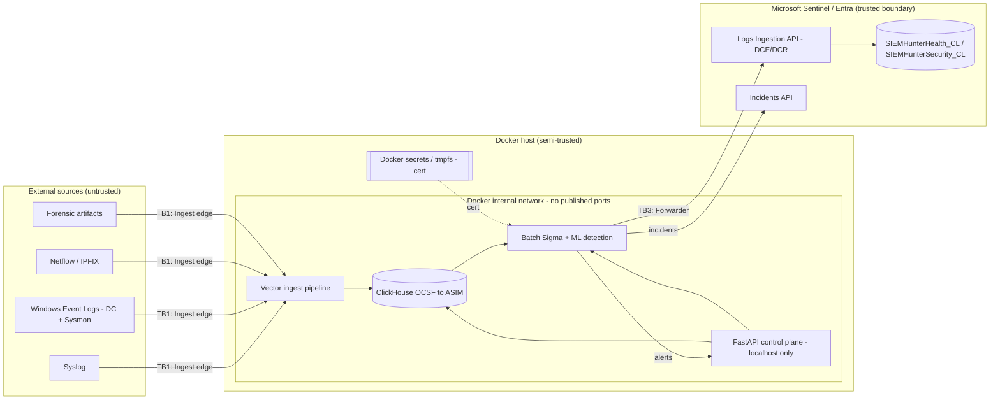
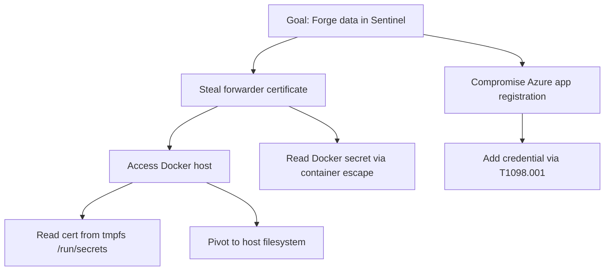
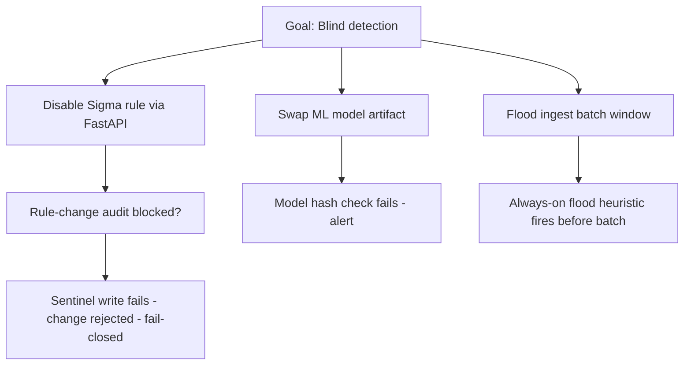

# 14 — SIEMhunter Threat Model (STRIDE / Data-Flow)

> **Scope.** Internal threat model for the SIEMhunter on-premise collector agent
> (Docker Compose, lab / home-lab scale). It covers ingest, local normalization
> and detection in ClickHouse, and forwarding to Microsoft Sentinel via the Logs
> Ingestion API.
>
> **STRIDE** = Spoofing, Tampering, Repudiation, Information disclosure, Denial of
> service, Elevation of privilege. **ASIM** = Advanced Security Information Model.
> **OCSF** = Open Cybersecurity Schema Framework. **DCE/DCR** = Data Collection
> Endpoint / Data Collection Rule. **SP** = service principal. **IMDS** = Instance
> Metadata Service.

---

## 1. Assets

| Asset | Description | Criticality |
|-------|-------------|-------------|
| Forwarder certificate (private key) | Cert-based auth for the app registration that writes to Sentinel | **Critical** |
| Docker secrets | All credentials (cert, config tokens) mounted via Docker secrets / tmpfs | **Critical** |
| ClickHouse event data | Normalized OCSF→ASIM events at rest locally | High |
| Sigma rules | Local copy + pinned SigmaHQ snapshot driving batch detection | High |
| FastAPI control plane | Localhost-only authenticated management interface | High |
| `SIEMHunterHealth_CL` / `SIEMHunterSecurity_CL` | Custom Sentinel tables (health + security self-detections) | High |
| ML model artifacts | Anomaly model files loaded by the detection engine | Medium |

---

## 2. Adversary Model

| Class | Initial access | Goal |
|-------|----------------|------|
| **External log-feeder** | Controls a log source SIEMhunter ingests (syslog / WEF / netflow) | Inject malicious events or exploit the parser |
| **Host-landed attacker** | Code execution on the Docker host | Steal the forwarder certificate, tamper with rules/models, pivot to Sentinel |
| **Insider / compromised analyst** | Authenticated FastAPI access | Disable detections, manipulate rules, cover tracks |

---

## 3. Data-Flow Diagram

**Trust boundaries:**
- **TB1 — Ingest edge:** external source → Vector → ClickHouse
- **TB2 — Local store:** ClickHouse + detection engine + FastAPI (inside the host)
- **TB3 — Forwarder:** SIEMhunter → Sentinel / Azure

---

## 4. STRIDE per Trust Boundary

### Boundary 1 — Ingest edge (external source → Vector → ClickHouse)

| STRIDE | Threat | Mitigation |
|--------|--------|-----------|
| **S** | Attacker-controlled source hostname/IP used as identity | Collector-assigned provenance tag; never trust source-supplied identity fields |
| **T** | Malformed events / injection via log fields | Parameterized ClickHouse inserts (never string-concat); per-event size cap; decompression-ratio cap (zip-bomb defense); parse timeout |
| **R** | No way to prove what was received | Collector-side append-only log; Sentinel as tamper-evidence anchor |
| **I** | Collector logs may echo sensitive field values | Field redaction config on Vector |
| **D** | Log flood overwhelming parser or ClickHouse | Ingest rate limit; always-on flood heuristic in Vector pipeline; payload size caps |
| **E** | Parser exploit gaining container root | Non-root containers; read-only FS; `cap_drop ALL`; `no-new-privileges` |

### Boundary 2 — Local store (ClickHouse + detection engine + FastAPI)

| STRIDE | Threat | Mitigation |
|--------|--------|-----------|
| **S** | Attacker impersonates internal service | Docker internal network only; no published ports; service-to-service by container name |
| **T** | Rule modification to blind detection; model artifact swap | Rule-change audit appended to Sentinel BEFORE ClickHouse update (fail-closed); model artifact hash-verified on load; no pickle from untrusted paths |
| **R** | Rule disable leaves no trace | Rule-change audit in Sentinel (append-only; attacker can't modify) |
| **I** | ClickHouse data exfil from host | `internal: true` Docker network; ClickHouse never host-exposed |
| **D** | Detection engine CPU/memory exhaustion | Container cpu/mem/pids limits; ML models run advisory-only (don't gate ingest) |
| **E** | SSRF via FastAPI | Block loopback / link-local / IMDS `169.254.169.254` outbound from control plane |

### Boundary 3 — Forwarder (SIEMhunter → Sentinel / Azure)

| STRIDE | Threat | Mitigation |
|--------|--------|-----------|
| **S** | Attacker forges data into Sentinel by stealing the certificate | Cert `chmod 400`; Docker secrets (tmpfs); never bind-mount; HSM/TPM or Key Vault broker preferred (v0.2); short cert validity + rotation |
| **T** | MitM of Logs Ingestion API call | Mandatory TLS verification (never disable); pinned CA |
| **R** | Alert sent to Sentinel but no local record | Stable event ID + dedupe; local append-only ledger; ledger reconciliation self-detection |
| **I** | DCR-scoped identity used beyond its scope | Push identity scoped to DCR resource ID only; Conditional Access named-location IP restriction |
| **D** | Sentinel-side 429 back-pressure overwhelms forwarder | Respect `Retry-After`; exponential backoff; payload caps; emit health event |
| **E** | App-reg credential-add by attacker (T1098.001) | Minimize app-reg owners; KQL detection on T1098.001; Entra AuditLogs streaming required |

---

## 5. Attack Trees

### Tree 1 — Forge / tamper data in Sentinel

### Tree 2 — Disable / blind detection

---

## 6. Prioritized Findings

| # | Finding | Likelihood | Impact | Mitigation | Self-detection SIEMhunter should ship |
|---|---------|-----------|--------|-----------|--------------------------------------|
| 1 | Cert theft → Sentinel forgery | High | Critical | Docker secrets + chmod 400 + Key Vault v0.2 | 2nd-IP on SP (cert/2nd-IP self-detection) |
| 2 | Log injection via crafted syslog field | High | High | Parameterized inserts + provenance tag | Decompression-ratio anomaly |
| 3 | T1098.001 credential-add to app reg | Medium | Critical | App-reg owner minimization + Entra AuditLogs + KQL | Credential-add detection (SIEMHunterSecurity_CL) |
| 4 | Batch-window flood (blind 15–60 min) | High | High | Always-on Vector flood heuristic | Ingest-flood self-detection |
| 5 | Rule disable without trace | Medium | High | Fail-closed audit → Sentinel | Rule-disable audit self-detection |
| 6 | Ledger gap (Sentinel forgery/loss) | Low | Critical | Ledger reconciliation + egress IP self-report | Ledger-reconciliation self-detection |
| 7 | Zip-bomb / decompression attack | Medium | High | Decompression-ratio cap per source | Decompression-ratio cap trip |
| 8 | ML model artifact swap | Low | Medium | Hash verify on load; no pickle from untrusted path | Model-load integrity alert |
| 9 | SSRF via FastAPI → IMDS | Low | High | Block 169.254.169.254 outbound | SSRF attempt log |
| 10 | Container escape → host cert | Low | Critical | cap_drop ALL; no-new-privileges; userns-remap | Container anomaly (no direct self-detect) |
| 11 | Identifier injection (rule metadata as SQL column) | Medium | High | Whitelist/validate rule metadata before SQL use | N/A (build-time gate) |
| 12 | Entra diagnostic settings missing → silent zero detections | High | High | Prereq checklist + hardening gate | N/A (prereq) |
| 13 | Docker socket mounted by container | Low | Critical | Explicit no-Docker-socket policy in Compose | N/A (config gate) |

**Priority read:** Findings **#1, #2, #3, #4** carry the project. Cert theft (#1)
and credential-add (#3) both terminate in Sentinel forgery — the highest-impact
outcome — while log injection (#2) and batch-window flood (#4) are the most likely
to be attempted because they require only control of a log source. Everything
else is defense-in-depth around those four.

---

## 7. Key Mitigations Cross-Reference

| Finding(s) | Owning instruction file(s) |
|-----------|----------------------------|
| #1, #3 | `15-adr-forwarder-credential.md`, `09-security-and-iam.md` |
| #2, #7, #11 | `03-data-ingestion-spec.md`, `04-normalization-and-schema.md`, `16-hardening-checklist.md` |
| #4 | `05-detection-and-anomaly.md` |
| #5 | `06-api-control-plane.md`, `09-security-and-iam.md` |
| #6 | `07-sentinel-forwarding.md` |
| #8 | `05-detection-and-anomaly.md`, `16-hardening-checklist.md` |
| #9 | `06-api-control-plane.md`, `09-security-and-iam.md` |
| #10, #13 | `08-deployment-hybrid.md`, `16-hardening-checklist.md` |
| #12 | `07-sentinel-forwarding.md` (Entra diagnostic prereq) |

---

## 8. Residual Risk

Even with all mitigations shipped, residual risk concentrates in three places:

- **Host compromise is game-over for the cert (v0.1).** Until the v0.2 HSM/TPM or
  Key Vault broker lands, a host-landed attacker who escapes a container or reads
  tmpfs can obtain the forwarder private key. The compensating control is
  *detection, not prevention*: the 2nd-IP-on-SP self-detection (#1) plus short
  cert validity narrow the window. Treat the Docker host as the true crown jewel.
- **Self-detection depends on Sentinel-side prerequisites.** If Entra diagnostic
  settings are missing (#12), credential-add and 2nd-IP detections silently
  produce zero results. This is a single point of failure for the entire
  cloud-pivot detection story and must be a hard gate in the hardening checklist.
- **Advisory-only ML and batch cadence are deliberate trade-offs.** Running ML
  advisory-only avoids a DoS surface but means model evasion has limited blast
  radius; the 15–60 min batch window is an inherent blind interval that the
  always-on Vector flood heuristic (#4) only partially closes.
